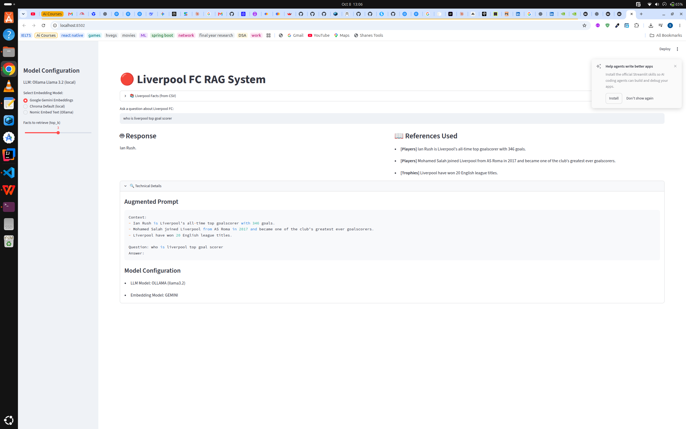
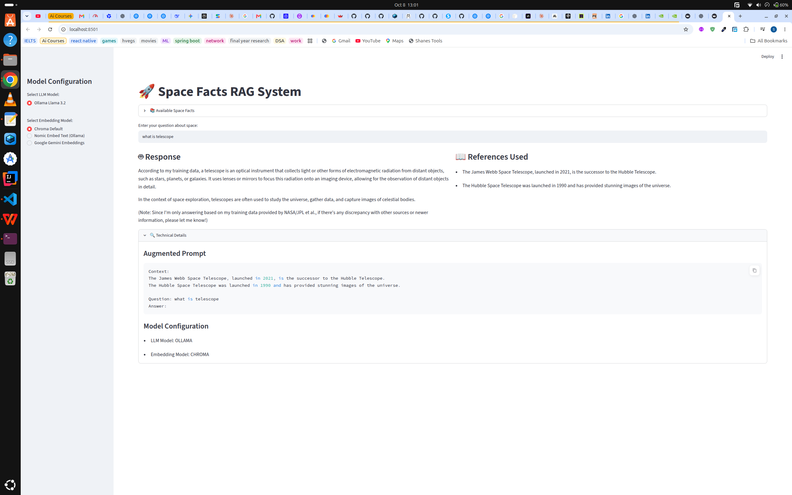

# 🔴 Liverpool FC RAG System

A small **Retrieval-Augmented Generation (RAG)** app built with Streamlit. Ask a question about Liverpool Football Club, and the app finds the most relevant facts in a CSV file and uses a local LLM to answer based **only** on those facts.



---

## How it works



1. **Load**: facts are read from `liverpool_facts.csv` with pandas.
2. **Embed**: each fact is turned into a vector (a list of numbers that captures its meaning) using the embedding model you pick.
3. **Store**: the vectors are saved in an in-memory **ChromaDB** collection.
4. **Retrieve**: your question is embedded the same way, and ChromaDB returns the `top_k` closest facts.
5. **Augment**: those facts are placed in the prompt as context.
6. **Generate**: **Llama 3.2** (running locally in Ollama) writes the answer. If the answer isn't in the facts, it says it doesn't know.

---

## Features

- 📄 Knowledge base loaded from a CSV file, so it's easy to extend
- 🔀 Three embedding options: **Google Gemini**, **Chroma Default** (local), **Nomic Embed Text** (Ollama)
- 🎚️ Sidebar slider to choose how many facts to retrieve (`top_k`)
- 🏷️ Each reference shows its category (Players, Trophies, Managers…)
- 🔍 "Technical Details" panel showing the exact prompt sent to the LLM

---

## Project structure

```
rag-pipeline/
├── rag_liverpool.py       # Streamlit RAG app
├── liverpool_facts.csv    # Knowledge base (id, category, fact)
├── .env                   # Your API keys (not committed)
├── illustration.png       # RAG pipeline illustration
├── liverpoolPic.png       # App screenshot
└── README.md
```

---

## Setup

### 1. Create a virtual environment (recommended)

```bash
python -m venv venv
source venv/bin/activate      # Linux / Mac
venv\Scripts\activate         # Windows
```

### 2. Install the libraries

```bash
pip install streamlit pandas chromadb openai python-dotenv google-genai
```

| Library | Purpose |
|---|---|
| `streamlit` | Web interface |
| `pandas` | Reads the CSV file |
| `chromadb` | Vector database |
| `openai` | Client used to talk to Ollama's OpenAI-compatible API |
| `python-dotenv` | Loads API keys from `.env` |
| `google-genai` | Gemini embeddings |

### 3. Install Ollama and pull the models

Download Ollama from [ollama.com](https://ollama.com), then:

```bash
ollama pull llama3.2           # LLM that writes the answers
ollama pull nomic-embed-text   # Optional: only for Nomic embeddings
```

### 4. Add your Gemini API key

Create a `.env` file in the project folder:

```
GEMINI_API_KEY=your-gemini-api-key
```

Get a free key at [Google AI Studio](https://aistudio.google.com/apikey). You can skip this step if you only use the Chroma or Nomic embeddings.

### 5. Run the app

```bash
streamlit run rag_liverpool.py
```

The app opens in your browser at `http://localhost:8501`.

---

## Example questions

- Who is Liverpool's all-time top scorer?
- What happened in the 2005 Champions League final?
- Who replaced Jurgen Klopp?
- How many times have Liverpool won the European Cup?
- What is the Merseyside derby?

---

## Adding your own facts

Open `liverpool_facts.csv` and add a new row in this format:

```csv
id,category,fact
21,Players,Your new fact goes here.
```

Each `id` must be unique. If a fact contains a comma, wrap it in double quotes. Restart the app to load the new facts.

---

## Troubleshooting

| Problem | Fix |
|---|---|
| `Error generating response: Connection error` | Ollama isn't running. Start it with `ollama serve`. |
| `model "llama3.2" not found` | Run `ollama pull llama3.2`. |
| Gemini errors / missing API key | Check `GEMINI_API_KEY` in `.env`, or switch to Chroma Default. |
| `AttributeError: ... 'embedding_fn'` | The selected embedding model isn't set up in `EmbeddingModel`. Choose one listed in the sidebar. |
| Deprecation warning from Chroma about the embedding function | Harmless. The custom Gemini function still works. |

---

## Notes

- OpenAI is currently disabled in this project, so everything except Gemini embeddings runs locally.
- ChromaDB runs in memory, so the database is rebuilt every time the app starts.
- The facts are a small sample for learning purposes. Some, like the number of league titles, will change over time.
-                  Your Question
                       │
                       ▼
              ┌─────────────────┐
              │ Streamlit App   │
              └────────┬────────┘
                       │
                       ▼
             Local Chroma Embedding
             ┌─────────────────────┐
             │ Chroma Default      │
             │ or Nomic/Ollama     │
             │ or Gemini           │
             └──────────┬──────────┘
                        │
                        ▼
                  ChromaDB
                        │
                  Similar facts
                        │
                        ▼
                Augmented Prompt
                        │
                        ▼
                 Ollama Llama 3.2
                        │
                        ▼
                     Answer
