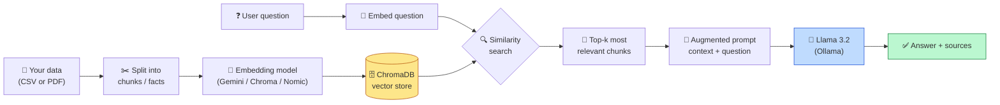
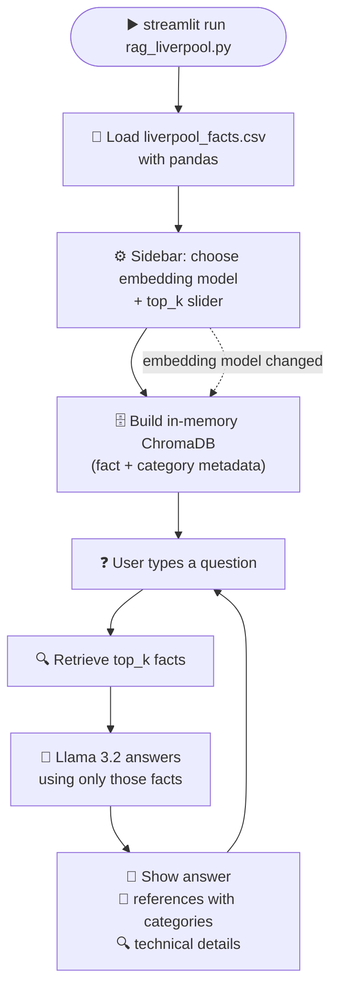
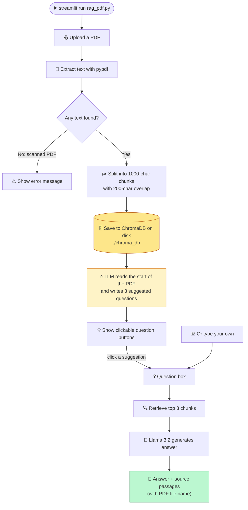

# 🤖 RAG Pipeline Projects

Two **Retrieval-Augmented Generation (RAG)** apps built with Streamlit, ChromaDB and a local LLM (Llama 3.2 via Ollama):

| App | What it does |
|---|---|
| 🔴 **Liverpool FC RAG** (`rag_liverpool.py`) | Answers questions about Liverpool Football Club using facts from a CSV file |
| 📄 **PDF RAG** (`rag_pdf.py`) | Upload any PDF and chat with it, with **💡 Smart Suggested Questions** |

Both apps answer **only** from your data. If the answer isn't there, they say "I don't know".


---

## 🧠 What is RAG?

An LLM on its own only knows what it was trained on. RAG gives it **your** data at question time:

1. **Retrieve** the most relevant pieces of your data
2. **Augment** the prompt with those pieces
3. **Generate** an answer grounded in them


---

## 🔀 Flowcharts

### Overall RAG pipeline



### 🔴 Liverpool FC RAG app



### 📄 PDF RAG app (with Smart Suggested Questions)


## ✨ Features

### 🔴 Liverpool FC RAG
- 📄 Knowledge base loaded from a CSV file, so it's easy to extend
- 🔀 Three embedding options: **Google Gemini**, **Chroma Default** (local), **Nomic Embed Text** (Ollama)
- 🎚️ Sidebar slider to choose how many facts to retrieve (`top_k`)
- 🏷️ Each reference shows its category (Players, Trophies, Managers…)
- 🔍 "Technical Details" panel showing the exact prompt sent to the LLM

### 📄 PDF RAG
- 📤 Upload any text-based PDF and ask questions about it
- ⭐ **Smart Suggested Questions**: after upload, the LLM suggests 3 questions you can click to ask instantly
- 💾 **Persistent storage**: chunks are saved to `./chroma_db`, so your PDFs are still there after a restart
- ✂️ Smart chunking that tries to end on full sentences, with overlap so context isn't lost
- 📚 Source passages show which PDF each answer came from
- 📊 Sidebar shows the embedding model, vector size and number of stored chunks

---

## 📁 Project structure

```
rag-pipeline/
├── rag_liverpool.py       # Liverpool FC RAG app (CSV)
├── liverpool_facts.csv    # Knowledge base (id, category, fact)
├── rag_pdf.py             # PDF RAG app with suggested questions
├── chroma_db/             # Created automatically by rag_pdf.py
├── .env                   # Your API keys (not committed)
├── illustration.png       # RAG pipeline illustration
├── liverpoolPic.png       # App screenshot
└── README.md
```

---

## ⚙️ Setup

### 1. Create a virtual environment (recommended)

```bash
python -m venv venv
source venv/bin/activate      # Linux / Mac
venv\Scripts\activate         # Windows
```

### 2. Install the libraries

```bash
pip install streamlit pandas chromadb openai python-dotenv google-genai pypdf
```

| Library | Purpose |
|---|---|
| `streamlit` | Web interface |
| `pandas` | Reads the CSV file |
| `chromadb` | Vector database |
| `openai` | Client used to talk to Ollama's OpenAI-compatible API |
| `python-dotenv` | Loads API keys from `.env` |
| `google-genai` | Gemini embeddings |
| `pypdf` | Extracts text from PDFs |

### 3. Install Ollama and pull the models

Download Ollama from [ollama.com](https://ollama.com), then:

```bash
ollama pull llama3.2           # LLM that writes the answers
ollama pull nomic-embed-text   # Optional: only for Nomic embeddings
```

### 4. Add your Gemini API key

Create a `.env` file in the project folder:

```
GEMINI_API_KEY=your-gemini-api-key
```

Get a free key at [Google AI Studio](https://aistudio.google.com/apikey). You can skip this step if you only use the Chroma or Nomic embeddings.

### 5. Run an app

```bash
streamlit run rag_liverpool.py   # Liverpool FC app
streamlit run rag_pdf.py         # PDF app
```

The app opens in your browser at `http://localhost:8501`.

---

## 💬 Example questions

**Liverpool FC app**
- Who is Liverpool's all-time top scorer?
- What happened in the 2005 Champions League final?
- Who replaced Jurgen Klopp?
- How many times have Liverpool won the European Cup?

**PDF app**
- Upload a PDF, then click one of the 💡 suggested questions, or ask your own, such as "Summarise the main points" or "What does the document say about X?"

---

## ➕ Adding your own Liverpool facts

Open `liverpool_facts.csv` and add a new row in this format:

```csv
id,category,fact
21,Players,Your new fact goes here.
```

Each `id` must be unique. If a fact contains a comma, wrap it in double quotes. Restart the app to load the new facts.

---

## 🛠️ Troubleshooting

| Problem | Fix |
|---|---|
| `Error generating response: Connection error` | Ollama isn't running. Start it with `ollama serve`. |
| `model "llama3.2" not found` | Run `ollama pull llama3.2`. |
| Gemini errors / missing API key | Check `GEMINI_API_KEY` in `.env`, or switch to Chroma Default. |
| `AttributeError: ... 'embedding_fn'` | The selected embedding model isn't set up. Choose one listed in the sidebar. |
| "No text found" when uploading a PDF | The PDF is scanned images. Use a PDF with selectable text. |
| No suggested questions appear | The LLM couldn't produce them (often because Ollama is down). The app still works without them. |
| Old PDFs still show up in answers | Delete the `chroma_db/` folder to start fresh. |
| Deprecation warning from Chroma about the embedding function | Harmless. The custom Gemini function still works. |

---

## 📝 Notes

- OpenAI is currently disabled in these projects (the code is commented out), so everything except Gemini embeddings runs locally.
- The Liverpool app rebuilds its database in memory on every start. The PDF app keeps its database on disk.
- Each embedding model gets its own ChromaDB collection, because vectors of different sizes can't be mixed.
- The Liverpool facts are a small sample for learning purposes. Some, like the number of league titles, will change over time.
